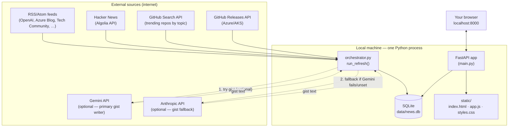
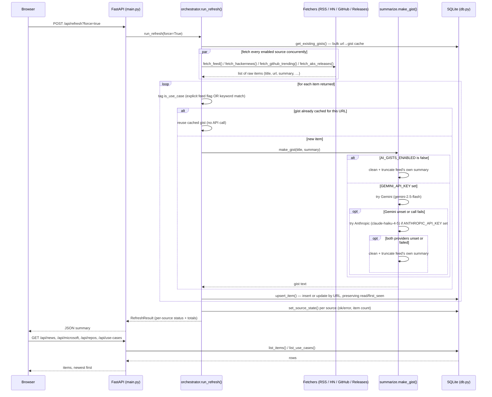
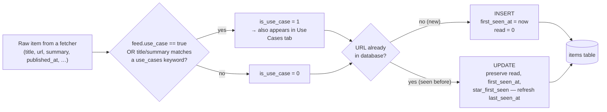
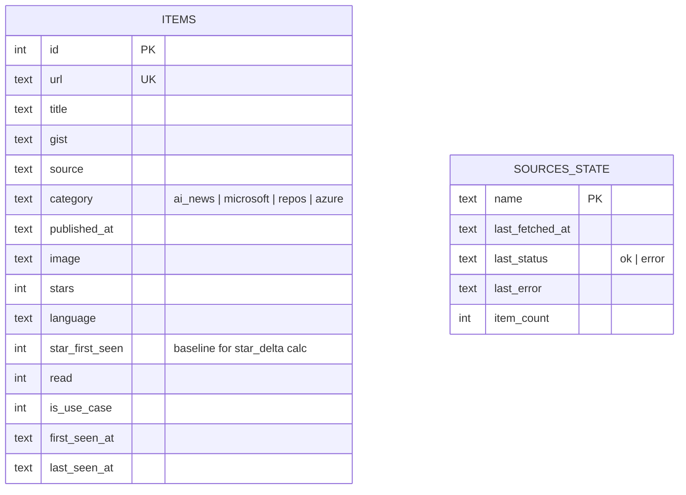
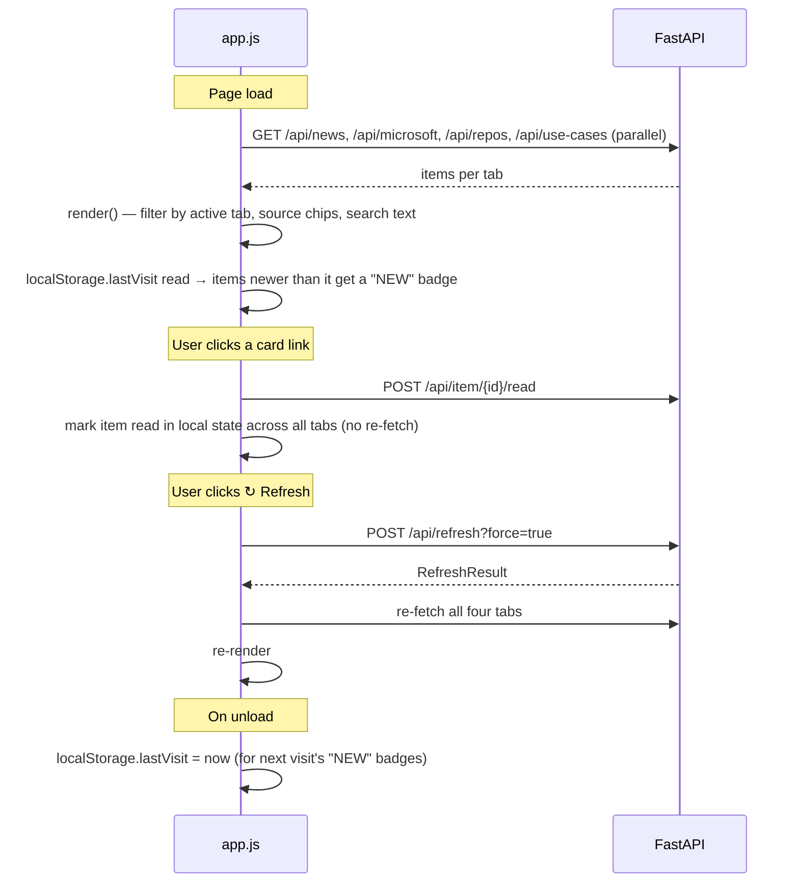
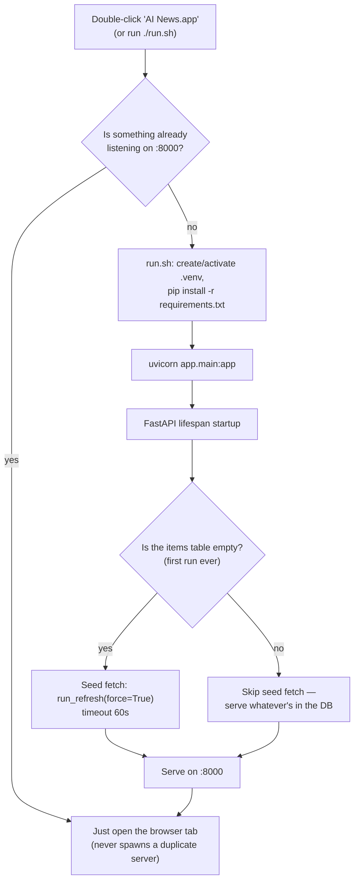

# AI News Console — Workflow

This document explains what the repo does, how its pieces fit together, and
walks through the exact sequence of events from "you double-click the app"
to "a card appears on your screen." Diagrams are [Mermaid](https://mermaid.js.org/)
— they render natively on GitHub and in VS Code's Markdown preview.

---

## 1. What this repo does

A single-user, locally-hosted dashboard that answers "what happened in AI
and Microsoft/Azure land since I last looked?" — no accounts, no cloud
backend, no paid API keys required. It runs entirely on your machine as one
Python process plus a SQLite file.

Four tabs, each backed by its own `/api/*` endpoint:

| Tab | Endpoint | Content |
|---|---|---|
| **AI News** | `/api/news` | General AI industry news (OpenAI, Anthropic, Google, HN front page, tech press) |
| **Microsoft** | `/api/microsoft` | Azure + Microsoft 365/Copilot/Security/DevOps blogs — the primary focus, weighted for an enterprise/Azure reader |
| **Repos** | `/api/repos` | Trending GitHub repos by topic (`ai`, `llm`, `agents`, `mcp`, `rag`, `azure`, …) |
| **Use Cases** | `/api/use-cases` | Real-world adoption stories, pulled from dedicated customer-story feeds and/or keyword-matched out of every other feed |

Everything that defines *what* gets fetched — every RSS URL, GitHub topic,
HN keyword, and use-case keyword — lives in one file, **`sources.yaml`**.
Adding a source never requires touching Python.

---

## 2. Architecture at a glance



Nothing here is a managed service — the "backend" is `uvicorn` running
`app/main.py`, the "database" is a single SQLite file, and the "frontend"
is hand-written JS with no build step.

---

## 3. Component map

```
app/
  main.py                FastAPI app: routes + startup lifecycle
  config.py               Settings (env vars) + sources.yaml loader
  db.py                    SQLite schema, upsert/query helpers
  models.py                Pydantic response shapes (Item, RefreshResult, SourceState)
  summarize.py              make_gist() — Gemini, then Claude, then fallback summary per item
  textutils.py               HTML stripping / sentence truncation helpers
  logging_conf.py             Sets up data/app.log
  fetchers/
    orchestrator.py            run_refresh() — the coordinator (§5)
    rss.py                      generic RSS/Atom fetcher (feedparser + httpx)
    hackernews.py                 HN Algolia front-page + keyword filter
    github_trending.py             GitHub Search API, dedup'd by repo
    aks_releases.py                 GitHub Releases API for one repo

static/
  index.html · app.js · styles.css     vanilla-JS frontend, no build step

sources.yaml               every feed URL, keyword list, and topic — edit this, not code
data/                       news.db (SQLite) + app.log + launcher.log — gitignored, created at runtime
macos/                      Desktop launcher (.app bundle) + icon generator
run.sh                      venv setup + server start + auto-open browser
```

---

## 4. The refresh workflow — the heart of the app

Everything the app does funnels through **`run_refresh()`** in
`app/fetchers/orchestrator.py`. It runs in three situations:

1. **Seed fetch** — automatically, once, the very first time the database is empty (app startup).
2. **Passive refresh** — whenever a tab is loaded and a source's TTL (`REFRESH_TTL_MINUTES`, default 60) has expired.
3. **Manual refresh** — when you click the ↻ button in the UI, which calls `POST /api/refresh?force=true` and bypasses the TTL for every source.



### Why it's resilient: one dead source never breaks the page

Each source fetch runs as its own `asyncio` task and is wrapped in a
try/except inside `_run_source()`. A 404, timeout, or malformed feed is
caught, logged to `data/app.log`, and recorded as `last_status: "error"` for
that source only — every other source keeps working and the page never goes
blank. This is why `sources.yaml` can carry best-effort URLs: a stale one
degrades gracefully instead of taking down the dashboard.

### Why gists aren't re-generated every hour

`get_existing_gists()` loads a `url → gist` map from SQLite *before* the
fetch loop starts. If a URL already has a gist (from a previous refresh —
which is the common case, since feeds re-serve the same recent items for
days), the cached gist is reused instead of calling any AI provider again.
Only genuinely new URLs pay for a fresh AI call. This matters once
`AI_GISTS_ENABLED=true` — without it, every hourly refresh would silently
re-summarize (and re-bill) articles it had already summarized.

### Gemini primary, Claude fallback

`app/summarize.py::make_gist()` tries providers in a fixed order, each
wrapped in its own try/except so a provider outage never breaks a refresh:

1. **Gemini** (`GEMINI_API_KEY`, model `GEMINI_MODEL` — default
   `gemini-2.5-flash`) — tried first if the key is set.
2. **Claude** (`ANTHROPIC_API_KEY`, `claude-haiku-4-5-20251001`) — tried only
   if Gemini is unset, or Gemini's call raised an exception.
3. **Cleaned feed summary** — the original fallback, used if neither
   provider is configured or both calls failed.

`GEMINI_API_KEY` must be a Google AI Studio API key
(`aistudio.google.com`) — the consumer Gemini Pro/Advanced app subscription
does not by itself grant programmatic API access.

---

## 5. What happens per item — classification and identity



The **URL is the identity** of an item (`UNIQUE` constraint in SQLite). This
is what makes "read" state, "first seen" timestamps, and the GitHub
star-delta baseline survive across refreshes — re-fetching a feed updates an
existing row in place rather than duplicating it.

---

## 6. Data model



`star_delta` (shown on repo cards as "+N this week") is computed at read
time in `main.py`, not stored: `stars − star_first_seen`. GitHub's API has
no historical star-count endpoint, so "this week's delta" is really "delta
since this app first saw the repo" — a repo reads as brand-new until it's
survived at least two refreshes.

---

## 7. Frontend workflow (browser side)



Source-filter chips and the search box are pure client-side filters over
data already fetched — no server round-trip. `is-read` styling and the
"NEW" badge are the only pieces of per-item UI state that live outside the
`items` table (read is server-side and persists; "NEW" is a local
`lastVisit` timestamp comparison, so it resets per browser/device).

---

## 8. Startup and launch workflow



The macOS launcher (`macos/install_launcher.sh`) bakes an **absolute path**
to `run.sh` into the generated `.app` bundle at install time — re-run the
installer if the repo folder is ever moved. The health-check in `run.sh`
(`lsof` on port 8000) is what prevents double-clicking the launcher twice
from spawning two servers.

---

## 9. Configuration surface

Everything tunable is either an environment variable (`.env`, copied from
`.env.example`) or a `sources.yaml` entry — never a code change.

| Variable | Default | Effect |
|---|---|---|
| `REFRESH_TTL_MINUTES` | `60` | How long a source's data is considered fresh before a page-load refresh re-fetches it |
| `GITHUB_TOKEN` | *(none)* | Raises GitHub API rate limit 60/hr → 5000/hr (used by Repos tab + AKS releases) |
| `GEMINI_API_KEY` | *(none)* | Primary AI-gist provider — a Google AI Studio key, not the consumer Gemini Pro/Advanced subscription |
| `GEMINI_MODEL` | `gemini-2.5-flash` | Gemini model used for gists |
| `ANTHROPIC_API_KEY` | *(none)* | Fallback AI-gist provider (`claude-haiku-4-5-20251001`), used only if Gemini is unset or its call fails |
| `AI_GISTS_ENABLED` | `false` | Master switch for AI gists; off (or both keys missing) → falls back to a cleaned feed summary |
| `TRENDING_WINDOW_DAYS` | `7` | How far back the GitHub trending search looks (`pushed:>=`) |
| `MAX_ITEMS_PER_SOURCE` | `20` | Cap on items kept per individual source per refresh |

`sources.yaml` sections: `feeds` (RSS/Atom, each tagged `ai_news` or
`microsoft`, optionally `use_case: true`), `hackernews` (keyword allowlist),
`github_topics` (topics + `min_stars`), `aks_releases` (which repo's
Releases feed to track), and `use_cases` (keywords scanned across *every*
feed's title+summary to catch case-study content that isn't from a
dedicated feed).

---

## 10. AI gist token cost — what a refresh actually spends

This only applies when `AI_GISTS_ENABLED=true` and at least one provider key is set — the default install (no `.env`) never calls either API and costs $0. Since Gemini is tried first (§4), it carries almost all of the real-world cost; Claude is a rarely-invoked fallback that only bills when Gemini is unset or its call fails.

**Models & pricing:**

| Provider | Model | Input $/1M | Output $/1M |
|---|---|---|---|
| Gemini (primary) | `gemini-flash-latest` (currently resolves to `gemini-3.5-flash`) | $0.30 | $2.50 |
| Claude (fallback) | `claude-haiku-4-5-20251001` | $1.00 | $5.00 |

Gemini also has a free tier — check your actual quota at `aistudio.google.com/rate-limit`. **Measured on this install's key: `gemini-flash-latest` is capped at 20 requests/day on the free tier**, and it's the *best* of the models tried (`gemini-flash-lite-latest`/`gemini-3.1-flash-lite`: 15/day; `gemini-3-flash-preview`: 5/day; `gemini-2.0-flash`, `gemini-2.0-flash-lite`, `gemini-2.5-pro`, `gemini-3-pro-preview`: 0/day, not available on this account's free tier at all). These caps are account-specific and may differ for you or change over time — re-verify at the URL above rather than assuming these numbers.

**What happens past the daily cap, on this install specifically:** `ANTHROPIC_API_KEY` is unset, so once Gemini's free-tier quota is exhausted for the day, every further gist call skips straight to the plain-text fallback (§4) rather than to Claude — the fallback chain works correctly, it just has nothing to fall to. Set `ANTHROPIC_API_KEY` if you want Claude to actually cover the overflow; otherwise expect only the first ~20 new items/day to get an AI-written gist, and the rest to show a cleaned feed summary instead. Check `data/app.log` for `RESOURCE_EXHAUSTED` warnings to confirm which regime you're in on a given day.

**Per-item cost.** Each gist call (`app/summarize.py::make_gist`) sends one fixed instruction (~30 tokens) plus the item's title and cleaned/truncated feed summary (truncated to 280 chars, so ≤ ~70 tokens), for **~80–125 input tokens per item** (~100 typical). Output caps at `max_tokens=120`, but a real 1–2 sentence gist runs **~30–70 output tokens** (~50 typical):

| Provider | Input (~100 tok) | Output (~50 tok) | Per item |
|---|---|---|---|
| Gemini | $0.00003 | $0.000125 | **~$0.000155** (≈ $0.16 per 1,000 items) |
| Claude | $0.0001 | $0.00025 | ~$0.00035 (≈ $0.35 per 1,000 items) |

*(Character counts, not a live token-count API call — no keys are configured in this install to measure exactly. Treat as a ballpark; re-measure with `count_tokens` on each provider's SDK if you need precision after enabling gists.)*

**Per-refresh cost — this is where the gist-caching fix (§4) matters.** `run_refresh()` only calls a provider for URLs it has never summarized before (`db.get_existing_gists()`); every repeat item across refreshes reuses its stored gist for free, regardless of which provider produced it originally.

| Refresh type | Items summarized | Est. cost (Gemini) |
|---|---|---|
| **Seed fetch** (first run ever, empty DB) | ~380–420 (every item across ~24 enabled sources) | **~$0.06–$0.07, one-time** |
| **Steady-state hourly refresh** (`REFRESH_TTL_MINUTES=60`) | ~10–30 genuinely new items (HN churns fast; most blogs publish a few posts/day; GitHub trending moves slowly) | **~$0.0015–$0.005 per refresh** |
| **Manual force-refresh** (↻ button, same hour) | ~0 new items if nothing's published since the last refresh | **~$0** |

**Daily/monthly, by how often you actually open the dashboard** (this is a "check it every morning" app, not a 24/7 server — see `README.md`), assuming Gemini handles almost everything:

| Usage pattern | Refreshes/day | Est. daily cost | Est. monthly cost |
|---|---|---|---|
| Open once each morning | 1 | ~$0.005 | **~$0.10–$0.15** |
| Open + a couple of manual refreshes | 3–5 | ~$0.01–$0.02 | **~$0.30–$0.60** |
| Left running, auto-refreshing hourly, 24/7 | 24 | ~$0.04–$0.10 | **~$1.30–$3** |

Even the worst case (always-on, hourly, forever, entirely on paid-tier Gemini) stays under $5/month — and likely $0 if it fits inside Gemini's free tier. The gist-caching fix is what keeps steady-state cost this low regardless of provider; without it, every hourly refresh would re-summarize the full ~400-item pool instead of just the new trickle, multiplying the "steady-state" row by ~15–20×. Claude fallback cost only shows up if Gemini has an outage or the key is removed — at that point the Claude-only numbers from the pricing table above apply until Gemini recovers.

## 11. Failure modes and where to look

| Symptom | Where to check | Why |
|---|---|---|
| A tab is empty or thin | `data/app.log` | Per-source fetch errors are logged there; other sources are unaffected |
| Refresh button does nothing / alert popup | Browser console + `data/app.log` | `doRefresh()` in `app.js` surfaces fetch failures as an alert |
| GitHub Trending / AKS Releases erroring with 403 | `data/app.log` — "rate limit exceeded" | No `GITHUB_TOKEN` set, or the 60/hr unauthenticated limit was hit from repeated manual refreshes |
| Gists look like plain feed text, not AI-written | `.env` + `data/app.log` | `AI_GISTS_ENABLED` is `false`, or both `GEMINI_API_KEY`/`ANTHROPIC_API_KEY` are unset, or both calls failed (logged as warnings) — this is the intended fallback, not a bug. If `app.log` shows `RESOURCE_EXHAUSTED`, you've hit Gemini's free-tier daily cap (§10) — add `ANTHROPIC_API_KEY` for real overflow coverage, or wait for the quota to reset |
| Port 8000 already in use by something unrelated | `run.sh` `PORT` var | Stop the other process, or edit the port in `run.sh` |
